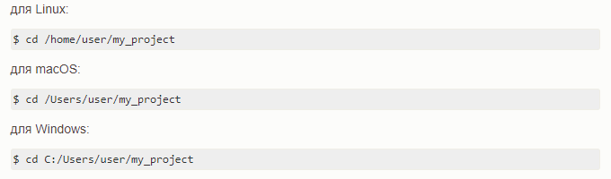
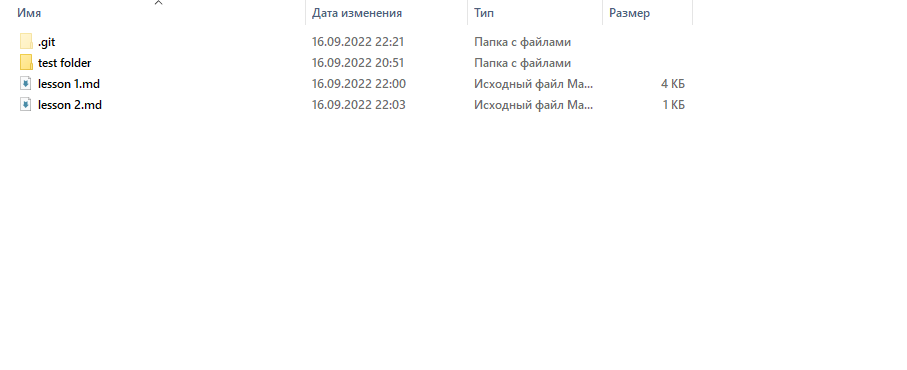
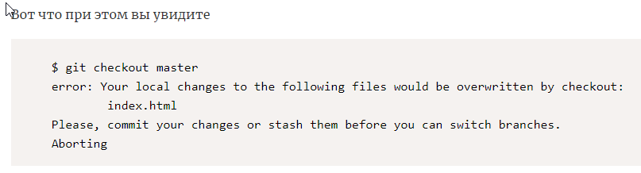
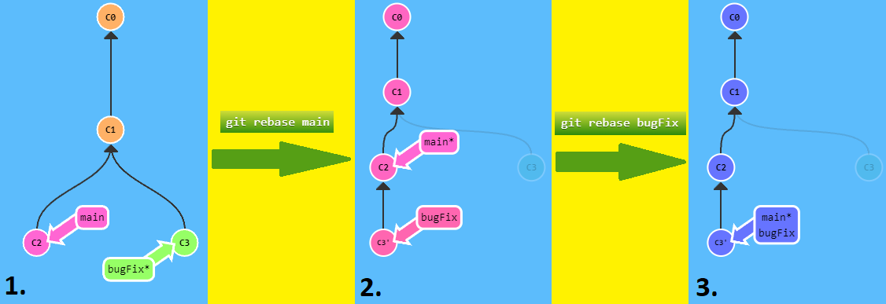

# Инструкция для работы с Git и удалёнными репозиториями

## Что такое Git?

Git - это одна из реализаций распределённых систем контроля версий, имеющая как и локальные, так и удалённые репозитории. Является самой популярной реализацией систем контроля версий в мире.

## Настройка Git

Вы установили себе Git. Давайте теперь его настроим, чтобы когда вы создавали снимок проекта, указывался автор.
Открываем терминал (Linux и MacOS) или консоль (Windows) и вводим следующие команды.

***git config --global user.name "ваше_имя"***

***git config --global user.email "адрес_почты@email.com"***

## Подготовка репозитория

Обычно вы получаете репозиторий Git одним из двух способов:

Вы можете взять локальный каталог, который в настоящее время не находится под версионным контролем, и превратить его в репозиторий Git, либо вы можете клонировать существующий репозиторий Git из любого места.
В обоих случаях вы получите готовый к работе Git репозиторий на вашем компьютере.

Создание репозитория в существующем каталоге. Если у вас уже есть проект в каталоге, который не находится под версионным контролем Git, то для начала нужно перейти в него. Если вы не делали этого раньше, то для разных операционных систем это выглядит по-разному:

Для создание репозитория необходимо выполнить команду ***git init***  в папке с репозиторием и у Вас создаться репозиторий (появится скрытая папка .git)

## Создание коммитов

Итак, у вас имеется настоящий Git-репозиторий и рабочая копия файлов для некоторого проекта. Вам нужно делать некоторые изменения и фиксировать *«снимки»* состояния (snapshots) этих изменений в вашем репозитории каждый раз, когда проект достигает состояния, которое вам хотелось бы сохранить.

Запомните, каждый файл в вашем рабочем каталоге может находиться в одном из двух состояний, под версионным контролем **(отслеживаемые)** и нет **(неотслеживаемые)**: 

* Отслеживаемые файлы — это те файлы, которые были в последнем снимке состояния проекта; они могут быть неизменёнными, изменёнными или подготовленными к коммиту. Если кратко, то отслеживаемые файлы — это те файлы, о которых знает Git.

* Неотслеживаемые файлы — это всё остальное, любые файлы в вашем рабочем каталоге, которые не входили в ваш последний снимок состояния и не подготовлены к коммиту. Когда вы впервые клонируете репозиторий, все файлы будут отслеживаемыми и неизменёнными, потому что Git только что их извлек и вы ничего пока не редактировали.

Как только вы отредактируете файлы, Git будет рассматривать их как изменённые, так как вы изменили их с момента последнего коммита. Вы индексируете эти изменения, затем фиксируете все проиндексированные изменения, а затем цикл повторяется.

### Git add

Для добавления измений в коммит используется команда ***git add***. Чтобы использовать команду ***git add*** напишите ***git add <имя файла>***, данная команда действует только для одного определенного файла, для того чтобы добавить все файлы нужно ввести комманду ***git add .***

### Просмотр состояния репозитория

Для того, чтобы посмотреть состояние репозитория используется команда ***git status***. Для этого необходимо в папке с репозиторием написать ***git status***, и вы увидите были ли измения в файлах, или их не было. Также можно ввести комманду ***git status -s*** или ***git status --short***, чтобы посмотреть изменения в более компактном виде.

### Создание коммитов

Для того, чтобы создать коммит(сохранение) необходимо выполнить команду ***git commit***. Выполняется она так: ***git commit -m "<сообщение к коммиту>***. Все файлы для коммита должны быть ***ДОБАВЛЕНЫ*** и сообщение к коммиту писать ***ОБЯЗАТЕЛЬНО***.

### Перемещение между сохранениями

Для того, чтобы перемещаться между коммитами, используется команда ***git checkout***. Используется она в папке с пепозиторием следующим образом: ***git checkout <номер коммита>***

### Журнал изменений
Для того, чтобы посмотреть все сделанные изменения в репозитории, используется команда __*git log*__. Для этого достаточно выполнить команду **_git log_** в папке с репозиторием.

Также можно воспользоваться коммандой **_git log --graph_**, для того чтобы посмотреть логи с использованием графика всех ветвлений, используемых в определенной ветке.

 Больше информации по теме  **создание коммитов** по ссылке: [Нажмите сюда](https://webdevkin.ru/courses/git/git-commit)

## Ветки в Git 

Почти каждая система контроля версий (СКВ) в какой-то форме поддерживает ветвление. Используя ветвление, Вы отклоняетесь от основной линии разработки и продолжаете работу независимо от неё, не вмешиваясь в основную линию. Во многих СКВ создание веток — это очень затратный процесс, часто требующий создания новой копии каталога с исходным кодом, что может занять много времени для большого проекта.

Некоторые люди, говоря о модели ветвления Git, называют ее «киллер-фича», что выгодно выделяет Git на фоне остальных СКВ. Что в ней такого особенного? Ветвление Git очень легковесно: 
* Операция создания ветки выполняется почти мгновенно, переключение между ветками туда-сюда, обычно, также быстро. 
* В отличие от многих других СКВ, Git поощряет процесс работы, при котором ветвление и слияние выполняется часто, даже по несколько раз в день. 
* Понимание и владение этой функциональностью дает вам уникальный и мощный инструмент, который может полностью изменить привычный процесс разработки.

### Создание ветки

Для того, чтобы создать ветку, используется команда ***git branch <название новой ветки>***. Ёщё есть комманда __*git checkout -b <название новой ветки>*__, которая также создает новую ветку, но при этом ещё и её использует комманду __*git checkout <название новой ветки>*__ позволяя "убить двух зайцев", и создать нужную ветку, и сразу переклюситься на нёё (очень удобная вещь).

### Просмотр всех веток 

Для того чтобы посмотреть сколько веток у вас в наличии, нужно ввести комманду ***git branch***

Также чтобы показать удаленные (remote) ветки используется ключ -r:

__*git branch -r*__

Перед тем, как выполнять данную команду, можно сначала обновить удаленные ветки у себя в репозитории, для этого используется команда:

__*git fetch*__

__*git fetch*__ загружает коммиты, файлы и ссылки из удаленного репозитория. Данная команда выполняется, когда вы хотите посмотреть, что изменилось в удаленном репозитории, что кто-то другой сделал в нем. При этом очень важно, что git fetch не изменяет никаких ваших локальных данных, над которыми вы работаете.

### Переключение между ветками
Для этого используется команда ***git checkout <название ветки>***
Обратите внимание, если у вас есть незакоммиченные изменения, то переключиться на другую ветку не получится - git за этим следит

Поэтому сначала или закоммитьте изменения в ветке, или откатите эти изменения - а уже потом переключайтесь. Это может показаться странным, но так сделано для безопасности, чтобы случайно не потерять информацию.

### Слияние веток

Что такое мердж или слияние веток - это перенос кода из одной ветки в другую. Например, когда мы заканчиваем работу над веткой, например, сделали новый функционал или поправили багу, мы сливаем ее в мастер. В мастере код проверяется еще раз и выкладывается на боевой сервер.

Сливать друг в друга можно любые ветки. Технически, с точки зрения git нет никакой разницы, сливается ветка с новым функционалом в мастер или наоборот. Для нас мастер - это основная ветка разработки, а для git это просто ветка.

Для того чтобы добавить ветку в текущую ветку используется команда ***git merge <название ветки>***

### Комманда __*git rebase <название ветки>*__

Второй способ объединения изменений в ветках - это rebasing. При ребейзе Git по сути копирует набор коммитов и переносит их в другое место.

Несмотря на то, что это звучит достаточно непонятно, преимущество __*git rebase <название ветки>*__ в том, что c его помощью можно делать чистые и красивые линейные последовательности коммитов. История коммитов будет чище, если вы применяете __*git rebase <название ветки>*__.

1. У нас здесь снова две ветки. Обрати внимание, что выбрана ветка __bugFix__ (отмечена звёздочкой)
Хочется сдвинуть наши изменения из __bugFix__ прямо на вершину ветки main. Благодаря этому всё будет выглядеть, как будто эти изменения делались последовательно, хотя на самом деле - параллельно.
Применим комманду __*git rebase main*__

2. Вот мы выбрали ветку __main__. Вперёд - сделаем rebase на __bugFix__.
Применим комманду __*git rebase bugFix*__

3. Так как __main__ был предком __bugFix__, git просто сдвинул ссылку на __main__ вперёд.

### Удаление веток

Чтобы удалить локальную ветку в Git нужно выполнить команду (вместо 'name branch' необходимо поставить название ветки, которую вы хотите удалить):

***"git branch -d 'name branch'"***

Обратите внимание на то, что ветка, которую вы удаляете, не должна быть вашей текущей веткой, в которой вы работаете, иначе отобразится ошибка вида:

    error: Cannot delete branch ’mybranch’ checked out at ’/path/to

Поэтому, если вам нужно удалить текущую ветку, то сначала нужно переключиться на какую-либо другую ветку, а только потом выполнять удаление.

Если вдруг возникает ошибка: 

    The branch ’mybranch’ is not fully merged. If you are sure you want to delete it 

и вы по прежнему хотите удалить ветку, то для принудительного удаления ветки можно воспользоваться опцией -D:

***git branch -D mybranch***

## Работа с удалёнными репозиториями.

Удаленный (иногда говорят "внешний") репозиторий – это версии вашего проекта, сохраненные на удаленном сервере. Доступ к репозиторию на таком сервере может осуществляться по интернету или по локальной сети.
Удаленный репозиторий – полноценный репозиторий, ничем не отличающийся от локального. У удаленного репозитория есть собственные ветки, собственный указатель HEAD, своя история коммитов и так далее.

Если мы подключим удаленный репозиторий к своему локальному, то у нас появятся копии всех ссылочных объектов удаленного репозитория. То есть, например, у удаленного репозитория есть ветка main, а у нас будет копия этой ветки – origin/main. Все такие ссылочные объекты (указатели, ветки и теги) удаленного репозитория хранятся почти там же, где и у локального – в директории .git/refs/remotes/<имя_удаленного_репозитория>.
Кстати принято называть удаленные ветки (то есть ветки удаленных репозиториев), приписывая к их названию имя удаленного репозитория. Например, если у нас есть удаленный репозиторий с именем origin и веткой main, то мы будем называть такую ветку origin/main. То же мы будем делать и со всеми остальными ссылочными объектами. Это может показаться излишним, но на самом деле это добавляет определенности и позволяет не запутаться в многочисленных названиях веток.

Таким образом, чтобы стать полноценным пользователем Git, важно овладеть навыками работы с удаленным репозиторием. Среди них – создание новых и копирование к себе уже существующих удаленных репозиториев, загрузка на сервер локальных коммитов и скачивание изменения с сервера. 

### Добавление удаленного репозитория к существующему локальному команда ___git remote add.___

Давайте разберемся, как добавить удаленный репозиторий к вашему локальному репу. Для этого в Git есть команда ___git remote add.___

Имя удаленного репозитория в команде ___git remote add___ вы можете придумать сами. Впоследствии, при работе с этим удаленным репозиторием, вы будете обращаться к нему по придуманному имени. Принято называть удаленный репозиторий __origin__, но строго говоря, никаких ограничений здесь нет.

Со ссылкой на удаленный репозиторий тоже все просто. Мы работаем с GitHub, поэтому эту ссылку можно взять, нажав на большую зеленую кнопку Code на странице репозитория на GitHub.

### Клонирование удаленного репозитория команда ___git clone___.

Необходимость клонировать существующий удаленный репозиторий возникает в ситуациях, когда вы решаете поработать над уже существующим кодом. Для выполнения этой операции в Git предусмотрена команда ___git clone___.

___git clone <ссылка на удаленный репозиторий>___

Ссылку на удаленный репозиторий можно получить тем же способом, что мы разбирали выше. Нужно нажать на зеленую кнопку __Code__ на главной странице репозитория на GitHub.

Заметьте, что клонирование по https возможно вообще всегда, а по ssh – нет. Чтобы клонировать репозитории по ssh, нужно, чтобы владелец удаленного репозитория на GitHub добавил к себе публичный ssh-ключ из пары, в то время, как секретный ssh-ключ от той же пары хранится у вас на компьютере, с которого вы выполняете git clone. Таким образом, если вы настроили ssh в своем аккаунте, то вы сможете беспрепятственно клонировать свои репозитории и по https, и по ssh. Но если вы пытаетесь клонировать чужой репозиторий по ssh, то скорее всего получите ошибку доступа.

Важно окончательный выбор протокола для клонирования, конечно, остается за читателем. Работать по https проще и быстрее, зато он считается менее защищенным, чем ssh, который в свою очередь труднее в настройке.

Давайте на примере разберем, как происходит клонирование. Клонируем удаленный репозиторий. При выполнении команды ___git сlone <ссылка на удаленный репозиторий>___ произойдет следующее:

1. В директории, откуда вы запустили команду ___git clone___, создается директория с именем репозитория. В нашем случае, если мы выполнили команду из директории пользователя, будет создана папка C:\users\username\<удаленный репозиторий>\.

2. В созданную директорию копируется репозиторий, все его ветки и коммиты.

3. В новосозданный локальный репозиторий добавляется удаленный репозиторий с именем origin и ссылкой, которую мы передавали в git clone. Это избавляет нас от необходимости вручную писать git remote add origin <ссылка на удаленный репозиторий> На этом процесс клонирования заканчивается.

Кстати вместо ___git clone___ можно было бы создать пустой локальный git-репозиторий, выполнив команду git init. Затем подключить наш удаленный репозиторий командой ___git remote add origin <ссылка на удаленный репозиторий>___ После чего вручную загрузить изменения с удаленного репозитория командой ___git pull___, которую мы рассмотрим ниже. Но зачем делать что-то вручную, если для этого есть автоматизированный инструмент из коробки.

### Получение изменений из удаленного репозитория команда ___git pull___.

На самом деле, новых команд здесь нет. Команда ___git pull___ это просто сокращение последовательного применения ___git fetch___ и ___git merge___. Но используется ___git pull___ намного чаще.

Команда ___git pull___ используется для синхронизации локальной рабочей копии и всех ссылочных объектов с удаленным репозиторием.

По сути, ___git pull___ - это то же самое, что ___git fetch___ + ___git merge___.

### Получение изменений из удаленного репозитория команда ___git fetch___.

Команда __git fetch__ используется для синхронизации локальных ссылочных объектов с этими же объектами в удаленном репозитории. Рабочую копию она не меняет.
Чтобы синхронизировать локальную рабочую копию с удаленным репозиторием, нужно слить удаленные ветки в локальные. Сделать это можно уже знакомой командой ___git merge___.

### Отправка изменений в удаленный репозиторий команда ___git push___

Команда ___git push___ используется для выгрузки содержимого локального репозитория в удаленный репозиторий. Она позволяет передать коммиты из локального репозитория в удаленный. Эта команда симметрична команде ___git fetch___: при извлечении с помощью ___fetch___ коммиты импортируются в локальные ветки, а при публикации с помощью ___push___ коммиты экспортируются в удаленные ветки. Настроить удаленные ветки можно с помощью команды ___git remote___(обсуждалась выше).

## Создание форка репозитория на GitHub. Пулл-реквесты.

Форк (от англ. fork – вилка) – точная копия репозитория, но в вашем аккаунте. Форки нужны, чтобы вносить свои изменения в проект, к репозиторию которого у вас нет прямого доступа.

Пулл-реквест (от англ. pull-request – запрос pull) – функция GitHub, позволяющая попросить владельца репозитория, от которого мы сделали форк, загрузить наши изменения обратно в свой репозиторий.

Если коротко, форки и пулл-реквесты нужны, чтобы любой пользователь мог внести свой вклад в любой открытый проект, репозиторий которого есть на GitHub. Кроме того, перед тем как влить ваши изменения в основной репозиторий, ответственные обязательно проверят ваш код на наличие ошибок и уязвимостей. Таким образом, даже если ваши изменения не примут, вы получите первоклассный code-review с указанием всех неточностей.

Продолжение следует ------->
